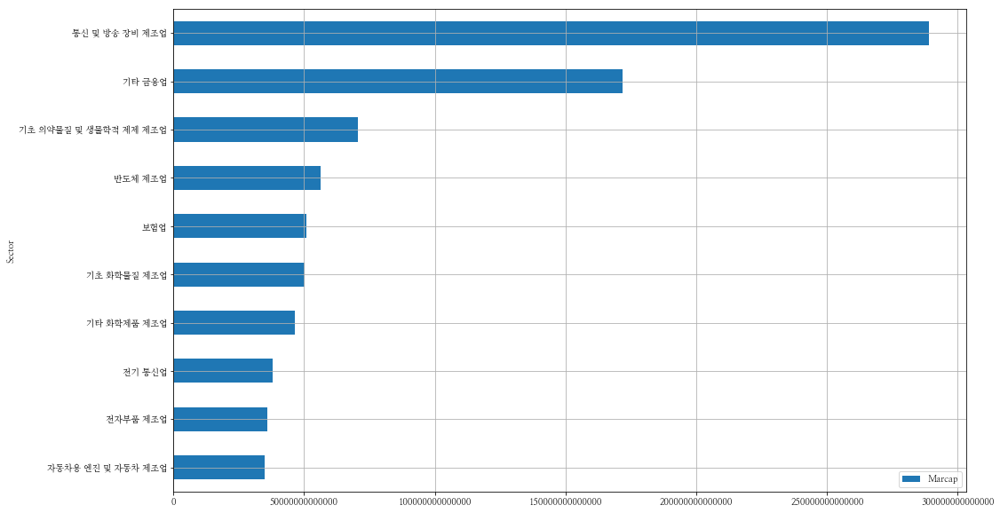

# 데이터셋 - 시가총액 데이터

* 한국거래소(KRX)에서 일자별 시가총액 순위 데이터
* 1995년~2018년(23년간) 데이터를 일자별 가격 포함 (CSV)

본 문서는 개요 문서 입니다. 더 상세한 설명은 [여기](http://nbviewer.jupyter.org/9ef9c9c87ba073338fa65a87643dc654)를 참고하세요
    

## 상장회사 시가총액 데이터

거래소의 시가총액 데이터는 특정 일자의 전종목, 시가총액, 주식수 등의 데이터를 포함하고 있습니다.  다음  링크로 바로 접근하거나  메뉴에서 다음과 같은 순서로접근할 수 있습니다. 

[http://marketdata.krx.co.kr/contents/MKD/04/0406/04060100/MKD04060100.jsp]()

시장정보 → 주식 → 순위정보 → 시가총액 상/하위


    

# marcap Datasets
일자별 시가총액 데이터를 다운로드 하여 년도별 csv 파일로 묶은 데이터 세트  

https://github.com/FinanceData/marcap

* 1995-05-02 ~ 2018-10-31 시가총액 데이터
* 10,473,005 rows X 17 columns 

## marcap Datasets Columns

* Date : 날짜
* Code : 종목코드
* Name : 종명이름 
* Open : 시가
* High : 고가
* Low : 저가
* Close : 종가
* Volume : 거래량
* Amount : 거래대금
* Changes : 전일대비
* ChagesRatio : 전일비
* Marcap : 시가총액(백만원)
* Stocks : 상장주식수
* MarcapRatio : 시가총액비중(%)
* ForeignShares : 외국인 보유주식수
* ForeignRatio : 외국인 지분율(%)
* Rank: 시가총액 순위 (당일)

## 데이터 가져오기

git 명령을 사용하여 깃허브 저장소를 복제(clone)한다.


```python
! git clone "https://github.com/FinanceData/marcap.git" marcap
```

    'marcap'에 복제합니다...
    remote: Enumerating objects: 7, done.
    remote: Counting objects: 100% (7/7), done.
    remote: Compressing objects: 100% (7/7), done.
    remote: Total 76 (delta 1), reused 1 (delta 0), pack-reused 69
    오브젝트 묶음 푸는 중: 100% (76/76), 완료.
    연결을 확인하는 중입니다... 완료.
    파일을 가져옵니다: 100% (27/27), 완료.


```python
# 유틸함수 사용
from marcap.marcap_utils import marcap_date
from marcap.marcap_utils import marcap_date_range

df = marcap_date_range('2017-01-01', '2018-10-31')

print('row count:', len(df))
df.head()
```

    row count: 1022346


<table border="1" class="dataframe">
  <thead>
    <tr style="text-align: right;">
      <th></th>
      <th>Code</th>
      <th>Name</th>
      <th>Close</th>
      <th>Changes</th>
      <th>ChagesRatio</th>
      <th>Volume</th>
      <th>Amount</th>
      <th>Open</th>
      <th>High</th>
      <th>Low</th>
      <th>Marcap</th>
      <th>MarcapRatio</th>
      <th>Stocks</th>
      <th>ForeignShares</th>
      <th>ForeignRatio</th>
      <th>Rank</th>
      <th>Date</th>
    </tr>
  </thead>
  <tbody>
    <tr>
      <th>0</th>
      <td>005930</td>
      <td>삼성전자</td>
      <td>1805000.0</td>
      <td>3000.0</td>
      <td>0.2</td>
      <td>93012.0</td>
      <td>1.679318e+11</td>
      <td>1799000.0</td>
      <td>1812000.0</td>
      <td>1794000.0</td>
      <td>2.539262e+14</td>
      <td>16.77</td>
      <td>140679337.0</td>
      <td>71423750.0</td>
      <td>50.77</td>
      <td>1.0</td>
      <td>2017-01-02</td>
    </tr>
    <tr>
      <th>1</th>
      <td>000660</td>
      <td>SK하이닉스</td>
      <td>45800.0</td>
      <td>1100.0</td>
      <td>2.5</td>
      <td>1547681.0</td>
      <td>7.074124e+10</td>
      <td>44750.0</td>
      <td>46000.0</td>
      <td>44600.0</td>
      <td>3.334251e+13</td>
      <td>2.20</td>
      <td>728002365.0</td>
      <td>373685775.0</td>
      <td>51.33</td>
      <td>2.0</td>
      <td>2017-01-02</td>
    </tr>
    <tr>
      <th>2</th>
      <td>005380</td>
      <td>현대자동차</td>
      <td>150000.0</td>
      <td>4000.0</td>
      <td>2.7</td>
      <td>545854.0</td>
      <td>8.135673e+10</td>
      <td>146000.0</td>
      <td>150500.0</td>
      <td>145500.0</td>
      <td>3.304147e+13</td>
      <td>2.18</td>
      <td>220276479.0</td>
      <td>95830167.0</td>
      <td>43.50</td>
      <td>3.0</td>
      <td>2017-01-02</td>
    </tr>
    <tr>
      <th>3</th>
      <td>005935</td>
      <td>삼성전자우</td>
      <td>1440000.0</td>
      <td>7000.0</td>
      <td>0.5</td>
      <td>10822.0</td>
      <td>1.556876e+10</td>
      <td>1432000.0</td>
      <td>1448000.0</td>
      <td>1415000.0</td>
      <td>2.953933e+13</td>
      <td>1.95</td>
      <td>20513427.0</td>
      <td>15993799.0</td>
      <td>77.97</td>
      <td>4.0</td>
      <td>2017-01-02</td>
    </tr>
    <tr>
      <th>4</th>
      <td>015760</td>
      <td>한국전력공사</td>
      <td>43900.0</td>
      <td>-150.0</td>
      <td>-0.3</td>
      <td>745355.0</td>
      <td>3.294252e+10</td>
      <td>44200.0</td>
      <td>44600.0</td>
      <td>43850.0</td>
      <td>2.818222e+13</td>
      <td>1.86</td>
      <td>641964077.0</td>
      <td>200901131.0</td>
      <td>31.29</td>
      <td>5.0</td>
      <td>2017-01-02</td>
    </tr>
  </tbody>
</table>


```python
# 삼성전자(005930), 시가총액 비중의 변화
code = '005930'
df_stock = marcap_date_range('2017-01-01', '2018-12-31', code)
df_stock['MarcapRatio'].plot(figsize=(16, 6))
```


```python
import pandas as pd

# https://github.com/FinanceData/stock_master 종목 마스터
url = 'https://github.com/FinanceData/stock_master/raw/master/stock_master.csv.gz'
df_master = pd.read_csv(url, dtype={'Symbol':str, 'Industy_code':str} )

# 시가총액 데이터 2018-10-30
df_marcap = marcap_date('2018-10-30')

# 시가총액 데이터와 종목 마스터 병합
df_merge = pd.merge(df_marcap[['Code', 'Name', 'Marcap']], df_master[['Symbol', 'Sector']], left_on='Code', right_on="Symbol")

print('row count:', len(df_merge))
df_merge.head(10)
```

    row count: 2208


<table border="1" class="dataframe">
  <thead>
    <tr style="text-align: right;">
      <th></th>
      <th>Code</th>
      <th>Name</th>
      <th>Marcap</th>
      <th>Symbol</th>
      <th>Sector</th>
    </tr>
  </thead>
  <tbody>
    <tr>
      <th>0</th>
      <td>005930</td>
      <td>삼성전자</td>
      <td>2.718584e+14</td>
      <td>005930</td>
      <td>통신 및 방송 장비 제조업</td>
    </tr>
    <tr>
      <th>1</th>
      <td>000660</td>
      <td>SK하이닉스</td>
      <td>4.964976e+13</td>
      <td>000660</td>
      <td>반도체 제조업</td>
    </tr>
    <tr>
      <th>2</th>
      <td>068270</td>
      <td>셀트리온</td>
      <td>2.827678e+13</td>
      <td>068270</td>
      <td>기초 의약물질 및 생물학적 제제 제조업</td>
    </tr>
    <tr>
      <th>3</th>
      <td>207940</td>
      <td>삼성바이오로직스</td>
      <td>2.633367e+13</td>
      <td>207940</td>
      <td>기초 의약물질 및 생물학적 제제 제조업</td>
    </tr>
    <tr>
      <th>4</th>
      <td>051910</td>
      <td>LG화학</td>
      <td>2.389551e+13</td>
      <td>051910</td>
      <td>기초 화학물질 제조업</td>
    </tr>
    <tr>
      <th>5</th>
      <td>005380</td>
      <td>현대자동차</td>
      <td>2.296933e+13</td>
      <td>005380</td>
      <td>자동차용 엔진 및 자동차 제조업</td>
    </tr>
    <tr>
      <th>6</th>
      <td>005490</td>
      <td>포스코</td>
      <td>2.214546e+13</td>
      <td>005490</td>
      <td>1차 철강 제조업</td>
    </tr>
    <tr>
      <th>7</th>
      <td>017670</td>
      <td>SK텔레콤</td>
      <td>2.172060e+13</td>
      <td>017670</td>
      <td>전기 통신업</td>
    </tr>
    <tr>
      <th>8</th>
      <td>028260</td>
      <td>삼성물산</td>
      <td>2.058137e+13</td>
      <td>028260</td>
      <td>기타 전문 도매업</td>
    </tr>
    <tr>
      <th>9</th>
      <td>105560</td>
      <td>KB금융</td>
      <td>2.038294e+13</td>
      <td>105560</td>
      <td>기타 금융업</td>
    </tr>
  </tbody>
</table>

```python
# 섹터별 시가총액
df_sector_corp_marcap = df_merge.groupby('Sector').sum().sort_values('Marcap', ascending=False)[:10]
df_sector_corp_marcap
```

<table border="1" class="dataframe">
  <thead>
    <tr style="text-align: right;">
      <th></th>
      <th>Marcap</th>
    </tr>
    <tr>
      <th>Sector</th>
      <th></th>
    </tr>
  </thead>
  <tbody>
    <tr>
      <th>통신 및 방송 장비 제조업</th>
      <td>2.888233e+14</td>
    </tr>
    <tr>
      <th>기타 금융업</th>
      <td>1.717551e+14</td>
    </tr>
    <tr>
      <th>기초 의약물질 및 생물학적 제제 제조업</th>
      <td>7.051449e+13</td>
    </tr>
    <tr>
      <th>반도체 제조업</th>
      <td>5.632019e+13</td>
    </tr>
    <tr>
      <th>보험업</th>
      <td>5.087775e+13</td>
    </tr>
    <tr>
      <th>기초 화학물질 제조업</th>
      <td>5.004896e+13</td>
    </tr>
    <tr>
      <th>기타 화학제품 제조업</th>
      <td>4.632344e+13</td>
    </tr>
    <tr>
      <th>전기 통신업</th>
      <td>3.793525e+13</td>
    </tr>
    <tr>
      <th>전자부품 제조업</th>
      <td>3.598522e+13</td>
    </tr>
    <tr>
      <th>자동차용 엔진 및 자동차 제조업</th>
      <td>3.498302e+13</td>
    </tr>
  </tbody>
</table>


```python
df_sector_corp_marcap[::-1].plot(kind='barh', figsize=(16, 10))
```




```python
# 삼성전자(005930) 시가총액 비중의 변화

df_stock['MarcapRatio'].plot(figsize=(16, 6))
```


```python
# https://github.com/FinanceData/stock_master
import pandas as pd

url = 'https://github.com/FinanceData/stock_master/raw/master/stock_master.csv.gz'
df_master = pd.read_csv(url, dtype={'Symbol':str, 'Industy_code':str} )
df_master.head(10)
```

<table border="1" class="dataframe">
  <thead>
    <tr style="text-align: right;">
      <th></th>
      <th>Symbol</th>
      <th>Name</th>
      <th>Market</th>
      <th>Listing</th>
      <th>Industry</th>
      <th>Sector</th>
      <th>Industy_code</th>
      <th>Industy_name</th>
    </tr>
  </thead>
  <tbody>
    <tr>
      <th>0</th>
      <td>001040</td>
      <td>CJ</td>
      <td>KOSPI</td>
      <td>True</td>
      <td>지주회사</td>
      <td>기타 금융업</td>
      <td>64992</td>
      <td>지주회사</td>
    </tr>
    <tr>
      <th>1</th>
      <td>011150</td>
      <td>CJ씨푸드</td>
      <td>KOSPI</td>
      <td>True</td>
      <td>수산물(어묵,맛살)가공품 도매,원양수산업,수출입</td>
      <td>기타 식품 제조업</td>
      <td>10799</td>
      <td>그 외 기타 식료품 제조업</td>
    </tr>
    <tr>
      <th>2</th>
      <td>012630</td>
      <td>HDC</td>
      <td>KOSPI</td>
      <td>True</td>
      <td>토목공사,건축공사,아파트분양사업,재개발/재건축사업</td>
      <td>건물 건설업</td>
      <td>4111</td>
      <td>주거용 건물 건설업</td>
    </tr>
    <tr>
      <th>3</th>
      <td>082740</td>
      <td>HSD엔진</td>
      <td>KOSPI</td>
      <td>True</td>
      <td>대형선박용엔진,내연발전엔진</td>
      <td>일반 목적용 기계 제조업</td>
      <td>29111</td>
      <td>내연기관 제조업</td>
    </tr>
    <tr>
      <th>4</th>
      <td>001390</td>
      <td>KG케미칼</td>
      <td>KOSPI</td>
      <td>True</td>
      <td>콘크리트혼화제, 비료, 친환경농자재, 수처리제</td>
      <td>기초 화학물질 제조업</td>
      <td>201</td>
      <td>기초 화학물질 제조업</td>
    </tr>
    <tr>
      <th>5</th>
      <td>010060</td>
      <td>OCI</td>
      <td>KOSPI</td>
      <td>True</td>
      <td>타르제품,카본블랙,무수프탈산,농약원제,석탄화학제품,정밀화학제품,플라스틱창호재 제조,판매</td>
      <td>기초 화학물질 제조업</td>
      <td>20129</td>
      <td>기타 기초 무기화학 물질 제조업</td>
    </tr>
    <tr>
      <th>6</th>
      <td>002360</td>
      <td>SH에너지화학</td>
      <td>KOSPI</td>
      <td>True</td>
      <td>합성수지(PS/EPS,ABS수지) 제조</td>
      <td>기초 화학물질 제조업</td>
      <td>201</td>
      <td>기초 화학물질 제조업</td>
    </tr>
    <tr>
      <th>7</th>
      <td>001740</td>
      <td>SK네트웍스</td>
      <td>KOSPI</td>
      <td>True</td>
      <td>종합무역업(전자전기제품,섬유,에너지화학제품,철강금속제품),의류,수입산합판,MDF판매...</td>
      <td>기타 전문 도매업</td>
      <td>467</td>
      <td>기타 전문 도매업</td>
    </tr>
    <tr>
      <th>8</th>
      <td>011810</td>
      <td>STX</td>
      <td>KOSPI</td>
      <td>True</td>
      <td>에너지 원료(석탄,석유),산업기자재(기계부품) 도매</td>
      <td>상품 종합 도매업</td>
      <td>46800</td>
      <td>상품 종합 도매업</td>
    </tr>
    <tr>
      <th>9</th>
      <td>071970</td>
      <td>STX중공업</td>
      <td>KOSPI</td>
      <td>True</td>
      <td>조선기자재, 기계부품, 엔진산업환경발전설비, 플랜트(EPC)</td>
      <td>일반 목적용 기계 제조업</td>
      <td>29119</td>
      <td>기타 기관 및 터빈 제조업</td>
    </tr>
  </tbody>
</table>


```python
df_master[df_master['Symbol'] == '005930']
```


<table border="1" class="dataframe">
  <thead>
    <tr style="text-align: right;">
      <th></th>
      <th>Symbol</th>
      <th>Name</th>
      <th>Market</th>
      <th>Listing</th>
      <th>Industry</th>
      <th>Sector</th>
      <th>Industy_code</th>
      <th>Industy_name</th>
    </tr>
  </thead>
  <tbody>
    <tr>
      <th>355</th>
      <td>005930</td>
      <td>삼성전자</td>
      <td>KOSPI</td>
      <td>True</td>
      <td>IMT2000 서비스용 동기식 기지국,교환국장비,데이터단말기,동영상휴대폰,핵심칩,반...</td>
      <td>통신 및 방송 장비 제조업</td>
      <td>32091</td>
      <td>금속 가구 제조업</td>
    </tr>
  </tbody>
</table>


```python
# 시가총액 데이터 2018-10-30
df_marcap = marcap_date('2018-10-30')

# 시가총액
df_merge = pd.merge(df_marcap[['Code', 'Name', 'Marcap']], df_master[['Symbol', 'Sector']], left_on='Code', right_on="Symbol")

print('row count:', len(df_merge))
df_merge.head()
```

    row count: 2208


<table border="1" class="dataframe">
  <thead>
    <tr style="text-align: right;">
      <th></th>
      <th>Code</th>
      <th>Name</th>
      <th>Marcap</th>
      <th>Symbol</th>
      <th>Sector</th>
    </tr>
  </thead>
  <tbody>
    <tr>
      <th>0</th>
      <td>005930</td>
      <td>삼성전자</td>
      <td>2.718584e+14</td>
      <td>005930</td>
      <td>통신 및 방송 장비 제조업</td>
    </tr>
    <tr>
      <th>1</th>
      <td>000660</td>
      <td>SK하이닉스</td>
      <td>4.964976e+13</td>
      <td>000660</td>
      <td>반도체 제조업</td>
    </tr>
    <tr>
      <th>2</th>
      <td>068270</td>
      <td>셀트리온</td>
      <td>2.827678e+13</td>
      <td>068270</td>
      <td>기초 의약물질 및 생물학적 제제 제조업</td>
    </tr>
    <tr>
      <th>3</th>
      <td>207940</td>
      <td>삼성바이오로직스</td>
      <td>2.633367e+13</td>
      <td>207940</td>
      <td>기초 의약물질 및 생물학적 제제 제조업</td>
    </tr>
    <tr>
      <th>4</th>
      <td>051910</td>
      <td>LG화학</td>
      <td>2.389551e+13</td>
      <td>051910</td>
      <td>기초 화학물질 제조업</td>
    </tr>
  </tbody>
</table>


```python
df_sector_corp_counts = df_merge['Sector'].value_counts()[:10]
df_sector_corp_counts
```


    특수 목적용 기계 제조업     122
    소프트웨어 개발 및 공급업    119
    기타 금융업            113
    전자부품 제조업          112
    자동차 신품 부품 제조업      91
    의약품 제조업            81
    기타 화학제품 제조업        76
    통신 및 방송 장비 제조업     73
    금융 지원 서비스업         58
    1차 철강 제조업          55
    Name: Sector, dtype: int64


```python
df_sector_corp_counts.plot.pie(figsize=(8, 8))
```


```python
# 섹터별 시가총액
df_sector_corp_marcap = df_merge.groupby('Sector').sum().sort_values('Marcap', ascending=False)[:20]
df_sector_corp_marcap
```


<table border="1" class="dataframe">
  <thead>
    <tr style="text-align: right;">
      <th></th>
      <th>Marcap</th>
    </tr>
    <tr>
      <th>Sector</th>
      <th></th>
    </tr>
  </thead>
  <tbody>
    <tr>
      <th>통신 및 방송 장비 제조업</th>
      <td>2.888233e+14</td>
    </tr>
    <tr>
      <th>기타 금융업</th>
      <td>1.717551e+14</td>
    </tr>
    <tr>
      <th>기초 의약물질 및 생물학적 제제 제조업</th>
      <td>7.051449e+13</td>
    </tr>
    <tr>
      <th>반도체 제조업</th>
      <td>5.632019e+13</td>
    </tr>
    <tr>
      <th>보험업</th>
      <td>5.087775e+13</td>
    </tr>
    <tr>
      <th>기초 화학물질 제조업</th>
      <td>5.004896e+13</td>
    </tr>
    <tr>
      <th>기타 화학제품 제조업</th>
      <td>4.632344e+13</td>
    </tr>
    <tr>
      <th>전기 통신업</th>
      <td>3.793525e+13</td>
    </tr>
    <tr>
      <th>전자부품 제조업</th>
      <td>3.598522e+13</td>
    </tr>
    <tr>
      <th>자동차용 엔진 및 자동차 제조업</th>
      <td>3.498302e+13</td>
    </tr>
    <tr>
      <th>1차 철강 제조업</th>
      <td>3.477098e+13</td>
    </tr>
    <tr>
      <th>소프트웨어 개발 및 공급업</th>
      <td>3.463124e+13</td>
    </tr>
    <tr>
      <th>의약품 제조업</th>
      <td>3.458348e+13</td>
    </tr>
    <tr>
      <th>기타 전문 도매업</th>
      <td>3.443700e+13</td>
    </tr>
    <tr>
      <th>자료처리, 호스팅, 포털 및 기타 인터넷 정보매개 서비스업</th>
      <td>2.860079e+13</td>
    </tr>
    <tr>
      <th>자동차 신품 부품 제조업</th>
      <td>2.824217e+13</td>
    </tr>
    <tr>
      <th>종합 소매업</th>
      <td>2.348042e+13</td>
    </tr>
    <tr>
      <th>선박 및 보트 건조업</th>
      <td>2.179640e+13</td>
    </tr>
    <tr>
      <th>컴퓨터 프로그래밍, 시스템 통합 및 관리업</th>
      <td>1.951488e+13</td>
    </tr>
    <tr>
      <th>기타 식품 제조업</th>
      <td>1.943381e+13</td>
    </tr>
  </tbody>
</table>


```python
df_sector_corp_marcap[::-1].plot(kind='barh', figsize=(16, 10))
```


```python
# 2018-10-01
df = marcap_date('2018-10-01')

df['Marcap_trillion'] = df['Marcap'] / 1e12 # 원 단위에서 조(10^12) 단위로 변경
df['Marcap_trillion'].sum()  # 시가총액 전체 (조단위)
```


    1843.5600760536697


시가총액 컬럼 df['Marcap_trillion']을 모두 더하면, 한국 주식시장 시가총액은 1,843조원 이다. (2018년 10월 1일 기준) 

# 더 상세한 설명
이 문서는 개요 문서입니다. 더 상세한 설명은 [여기](http://nbviewer.jupyter.org/9ef9c9c87ba073338fa65a87643dc654)를 참고하세요

#### 2018 FinanceData.KR [facebook.com/financedata](http://facebook.com/financedata)
